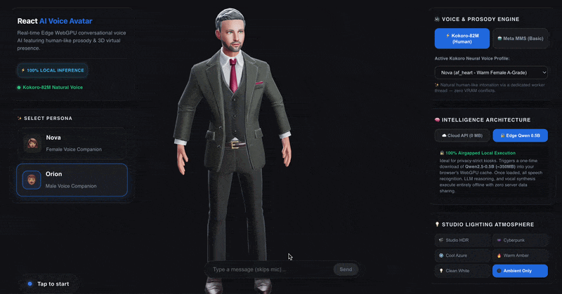

# React AI Voice Avatar (`react-ai-voice-avatar`) 🚀🗣️🧬

[](https://www.npmjs.com/package/react-ai-voice-avatar)
[](https://www.typescriptlang.org/)
[](https://playwright.dev)
[](https://react-ai-voice-avatar.vercel.app/)
[](https://opensource.org/licenses/MIT)

**The open-source alternative to real-time avatar APIs, as a React component.**

HeyGen Interactive Avatar, Tavus and Soul Machines sell a talking avatar that holds a conversation, rendered on their servers and billed per streaming minute. This does the same job as an npm install: the avatar renders on your user's GPU, so there is no video stream, no per-minute cost, and no third party in the middle of your conversations.

You bring the model. Point it at OpenAI, Anthropic, your own fine-tune or your existing chat endpoint, and keep your keys on your own backend. The package owns the parts that are tedious to build and easy to get wrong: microphone capture, knowing when someone has finished speaking, interrupting the avatar mid-sentence when they talk over it, streaming speech synthesis, and driving 52 ARKit facial blendshapes at 60 FPS so the mouth matches the words.

It can also run with no backend at all. Speech recognition, generation and voice all have in-browser implementations, which makes for a convincing demo and a genuinely offline kiosk. Most production apps will use their own model and keep only speech and lip-sync on the device.

### 🌐 [**Try the live demo ➔**](https://react-ai-voice-avatar.vercel.app/)
*Speech recognition, voice synthesis and lip-sync, all running in your browser tab.*



---

## 🌟 Two Entry Points (How to use it)

`react-ai-voice-avatar` provides two distinct ways to integrate into your app depending on your design needs. Both share the exact same underlying conversational state machine, Voice Activity Detection (VAD), and turn-taking logic.

### 🎧 Entry 1: The Headless Hook ("Voice Mode for your App")
If you are building a ChatGPT-style voice interface or a custom audio visualizer and **don't want any 3D dependencies**, use the headless hook. It provides all the speech-recognition, text-to-speech, and audio-reactive hooks with zero UI overhead.

Import it from `react-ai-voice-avatar/headless` and Three.js never enters your module graph. Measured on the same Next.js App Router build, one route rendering the 3D avatar and one rendering only the hook:

| Route | First Load JS |
| --- | --- |
| 3D avatar | 389 kB |
| Headless hook | 117 kB |

```tsx
// The /headless subpath is what keeps Three.js out of your bundle.
// Importing the hook from the package root pulls the 3D stack in with it.
import { useAiVoiceAvatar } from 'react-ai-voice-avatar/headless';

function MyChatGPTVoiceOrb() {
  const { startListening, stopListening, isListening, status } = useAiVoiceAvatar({
    // Standard integration: 100% Local TTS & STT
    ttsEngine: 'kokoro',
    ttsVoice: 'af_heart',
    
    // Connect your LLM
    onSubmit: async (transcript) => fetch('/api/chat', { method: 'POST', body: transcript }).then(r => r.body),
    
    // Audio-reactive callback for building your own glowing orb UI!
    onAudioLevelChange: (level, source) => updateOrbGlow(level, source)
  });

  return <button onClick={isListening ? stopListening : startListening}>Toggle Voice Mode</button>;
}
```

#### ☁️ Cloud Adapters (Per-Utterance Escape Hatches)
By default, the hook runs Whisper and Kokoro **100% locally** in the browser. But you can instantly widen your audience by bypassing the local ML models and injecting your own cloud TTS/STT providers via the `onTranscribe` and `onSynthesize` adapters!

```tsx
const { startListening } = useAiVoiceAvatar({
  // Bypass local Whisper: Send mic audio to Sarvam or OpenAI Whisper
  onTranscribe: async (audioFloat32Array) => {
    return await mySarvamSTT(audioFloat32Array);
  },
  
  // Bypass local Kokoro: Use ElevenLabs or OpenAI TTS
  onSynthesize: async (text) => {
    const res = await fetch('/api/elevenlabs', { method: 'POST', body: text });
    // Return an ArrayBuffer (MP3/WAV) - the hook automatically decodes it and plays it!
    return await res.arrayBuffer(); 
  },
  
  onSubmit: async (text) => fetch('/api/chat', { method: 'POST', body: text }).then(r => r.body),
});
```

---

### 🧑‍💼 Entry 2: The Full 3D Avatar 
If you want the full visual presence with 60FPS ARKit lip-syncing, use the drop-in 3D component. Under the hood, this is just a wrapper around the `useAiVoiceAvatar` hook that procedurally maps the audio to a 3D model!

📦 [**View Package on the Official NPM Registry ➔**](https://www.npmjs.com/package/react-ai-voice-avatar)

```bash
# If using the 3D Avatar, you must also install the Three.js ecosystem
npm install react-ai-voice-avatar three @react-three/fiber @react-three/drei
```

> [!NOTE]
> **React 18 Users:** Installing the latest `@react-three/drei` defaults to version 10, which demands React 19. If your project runs on React 18, install compatible Three.js React bindings explicitly:
> ```bash
> npm install @react-three/drei@^9 @react-three/fiber@^8
> ```

> [!IMPORTANT]
> **React 19.3 and `ERESOLVE`:** `@react-three/fiber@9.7` still declares its React peer as `>=19 <19.3`, so a default `npm install` alongside React 19.3 or newer fails with `ERESOLVE unable to resolve dependency tree`. This is a Three.js binding constraint, not a limit of this package: our own peer range accepts React 19.3.
>
> That range is over-cautious. We build and run a Next.js App Router app against React 19.3.0 with `@react-three/fiber@9.7.0` and the avatar renders, loads its models and speaks with no errors. So install past it rather than downgrading:
> ```bash
> npm install react-ai-voice-avatar three @react-three/fiber @react-three/drei --legacy-peer-deps
> ```
> If you would rather keep strict peer resolution, pinning React works too:
> ```bash
> npm install react@~19.2.0 react-dom@~19.2.0
> ```
> The headless entry point (`react-ai-voice-avatar/headless`) pulls in no Three.js at all, so it never hits this and works on any React 18 or 19 version.

### ⚡ DX & Performance (Lazy Code-Splitting)

To prevent the massive ML assets (WebGPU workers, 3D engines) from bloating your initial page load, use the built-in lazy wrapper. It will automatically code-split the 3D dependencies and render a sleek holographic **Skeleton UI** while the assets download in the background!

```tsx
import { AiVoiceAvatarLazy } from 'react-ai-voice-avatar';

// Use it exactly like the normal component!
<AiVoiceAvatarLazy avatarPreset="ananya" />
```

#### Show the avatar before anyone commits to a download

Lazy loading defers the 3D engine. The speech and language models are the larger
cost, and by default they start downloading as soon as the avatar mounts. On a
landing page most visitors only look, so render the avatar idle and load the
models when someone actually engages:

```tsx
const [engaged, setEngaged] = useState(false);

<AiVoiceAvatar loadModels={engaged} hideStatusPill={!engaged} />
<button onClick={() => setEngaged(true)}>Talk to it</button>
```

The live demo's landing page works this way.

#### 📐 Architectural Best Practices
- **Standard Import (`AiVoiceAvatar`)**: Recommended for full-screen applications where the avatar *is* the primary product (e.g., Kiosks, Digital Tutors). The browser aggressively downloads the 3D canvas and ML models immediately so the avatar is ready instantly.
- **Lazy Import (`AiVoiceAvatarLazy`)**: Recommended for widgets, modals, or sub-routes (e.g., a "Support Desk" chat bubble in a SaaS dashboard). Defers downloading the 1.5MB 3D engine and WebWorkers until the user actually opens the widget.

### ⚙️ Server Configuration (Optional Performance Boost)

The `react-ai-voice-avatar` engine is truly **zero-config**. You do not need to configure Vite `optimizeDeps`, Next.js Webpack overrides, or manually host Web Worker files—everything is dynamically bundled and executed automatically!

However, because our ONNX WebGPU engine leverages modern multi-threaded `SharedArrayBuffer` memory pipelines for maximum inference speed, your hosting server can optionally emit standard Cross-Origin Isolation HTTP headers (`COOP`/`COEP`) to unlock peak performance. If these headers are not present, the engine automatically falls back to single-threaded WebAssembly without crashing.

#### 🌐 Enabling Multi-threading on Production (Vercel, Netlify & Cloudflare)
To unlock multi-threaded performance, specify these isolation headers in your routing manifests:
- **Vercel (`vercel.json`)**: Add `"headers": [{ "source": "/(.*)", "headers": [{ "key": "Cross-Origin-Opener-Policy", "value": "same-origin" }, { "key": "Cross-Origin-Embedder-Policy", "value": "require-corp" }] }]`.
- **Netlify / Cloudflare Pages (`_headers` or `netlify.toml`)**: Add `/*\n  Cross-Origin-Opener-Policy: same-origin\n  Cross-Origin-Embedder-Policy: require-corp` to `public/_headers`.

#### ⚡ Enabling Multi-threading in Local Dev (Vite & Next.js)

**Vite (`vite.config.ts`)**:
```ts
export default defineConfig({
  plugins: [react()],
  server: {
    headers: {
      'Cross-Origin-Opener-Policy': 'same-origin',
      'Cross-Origin-Embedder-Policy': 'require-corp',
    },
  },
});
```

**Next.js (`next.config.mjs`)**:
```js
export default {
  async headers() {
    return [
      {
        source: '/(.*)',
        headers: [
          { key: 'Cross-Origin-Opener-Policy', value: 'same-origin' },
          { key: 'Cross-Origin-Embedder-Policy', value: 'require-corp' },
        ],
      },
    ];
  },
};
```

> [!CAUTION]
> **Strict CSP Policies:** If your enterprise enforces strict Content Security Policies that block `blob:` workers (`worker-src 'self'`), you can bypass our zero-config Blob loaders by passing the `workerBaseUrl` prop to the avatar and hosting the pre-compiled `.worker.js` files from our `dist/assets/` directory yourself.

## ⚡ 3D Avatar Quickstart

```tsx
import React, { useRef, useState } from 'react';
import { Canvas } from '@react-three/fiber';
import { OrbitControls } from '@react-three/drei';
import { AiVoiceAvatar, type AiVoiceAvatarHandle } from 'react-ai-voice-avatar';

export function App() {
  const avatarRef = useRef<AiVoiceAvatarHandle>(null);
  const [text, setText] = useState('');

  return (
    <div style={{ width: '100vw', height: '100vh', position: 'relative' }}>
      <Canvas camera={{ position: [0, 0.15, 2.2], fov: 32 }}>
        <color attach="background" args={['#101116']} />
        
        {/* Subtle studio lighting */}
        <pointLight position={[-3, 2, -2]} intensity={25} color="#E67E22" distance={6} />
        <pointLight position={[3, 1, -2]} intensity={20} color="#2980B9" distance={6} />
        
        <OrbitControls target={[0, 0.05, 0]} />
        
        {/* Connected Brain: Zero download, instant initialization! */}
        <AiVoiceAvatar
          ref={avatarRef}
          avatarPreset="ananya"
          lightingPreset="studio"
          ttsEngine="kokoro"
          ttsVoice="af_heart"
          // Connect your backend here (receives user speech transcript):
          onSubmit={async (text) => {
            const res = await fetch('/api/chat', { 
              method: 'POST', 
              body: JSON.stringify({ prompt: text }) 
            });
            return res.body; // Avatar natively reads streams!
          }}
        />
      </Canvas>

      {/* Fallback Text Input for noisy environments */}
      <form
        onSubmit={(e) => {
          e.preventDefault();
          if (text.trim() && avatarRef.current) {
            avatarRef.current.sendText(text);
            setText('');
          }
        }}
        style={{ position: 'absolute', bottom: '20px', left: '50%', transform: 'translateX(-50%)', display: 'flex', gap: '8px', zIndex: 100 }}
      >
        <input 
          value={text} 
          onChange={e => setText(e.target.value)} 
          placeholder="Type a message..." 
          style={{ padding: '8px 16px', borderRadius: '20px', border: 'none', background: 'rgba(255,255,255,0.9)', width: '300px' }}
        />
        <button type="submit" style={{ padding: '8px 16px', borderRadius: '20px', border: 'none', background: '#3b82f6', color: 'white', cursor: 'pointer' }}>
          Send
        </button>
      </form>
    </div>
  );
}
```

## 🔌 Connect Your Backend (Recipes)

The `onSubmit` prop natively accepts a `string`, an `AsyncIterable<string>`, or a `ReadableStream`. To connect your actual backend, simply drop in one of these copy-paste recipes to parse your streaming format!

> [!CAUTION]
> **API Keys Belong on the Server!** Never put your OpenAI or Anthropic API keys directly in the frontend browser code. Always route through your own backend endpoint (`/api/chat`).

### Recipe 0: Plain Text Stream (Fastest & Simplest)
If your backend uses Vercel AI SDK's `streamText(...).toTextStreamResponse()` or otherwise streams plain raw text, you can pass the stream natively without any parsing!

```tsx
onSubmit={async (text) => {
  const res = await fetch('/api/chat', { method: 'POST', body: JSON.stringify({ prompt: text }) });
  return res.body; // Natively supported!
}}
```

### Recipe 1: Vercel AI SDK (≤v4 Data Stream)
Older versions of the Vercel AI SDK stream data using a specific protocol (e.g., `0:"Hello"`). This recipe parses those chunks into clean text with a carry-over buffer for safe network boundaries.

```tsx
onSubmit={async function* (text) {
  const res = await fetch('/api/chat', { method: 'POST', body: JSON.stringify({ prompt: text }) });
  if (!res.body) return;
  const reader = res.body.getReader();
  const decoder = new TextDecoder();
  let buffer = '';
  
  while (true) {
    const { done, value } = await reader.read();
    if (done) break;
    buffer += decoder.decode(value, { stream: true });
    const lines = buffer.split('\n');
    buffer = lines.pop() ?? ''; // keep the trailing partial chunk
    for (const line of lines) {
      if (line.startsWith('0:')) {
        try { yield JSON.parse(line.substring(2)); } catch { /* ignore keep-alive / non-JSON frames */ }
      }
    }
  }
}}
```

### Recipe 2: OpenAI-Compatible SSE Endpoint (and AI SDK v5)
Standard Server-Sent Events (SSE) stream `data: {...}` blocks. This handles safe parsing across broken network chunk boundaries.

```tsx
onSubmit={async function* (text) {
  const res = await fetch('/api/chat', { method: 'POST', body: JSON.stringify({ prompt: text }) });
  if (!res.body) return;
  const reader = res.body.getReader();
  const decoder = new TextDecoder();
  let buffer = '';
  
  while (true) {
    const { done, value } = await reader.read();
    if (done) break;
    buffer += decoder.decode(value, { stream: true });
    const lines = buffer.split('\n');
    buffer = lines.pop() ?? ''; // keep the trailing partial chunk
    for (const line of lines) {
      if (line.startsWith('data: ') && line !== 'data: [DONE]') {
        try {
          const parsed = JSON.parse(line.substring(6));
          // AI SDK v5 emits {type:'text-delta', delta:'...'}; OpenAI emits choices[0].delta.content
          if (parsed.type === 'text-delta' && parsed.delta) {
            yield parsed.delta;
          } else if (parsed.choices?.[0]?.delta?.content) {
            yield parsed.choices[0].delta.content;
          }
        } catch { /* ignore keep-alive / non-JSON frames */ }
      }
    }
  }
}}
```

---

## 🗣️ Languages

English and Hindi both run entirely on the device. Set `ttsLanguage` and the
engine picks a matching voice, a matching speech-recognition model, and a
matching phoneme path.

```tsx
<AiVoiceAvatar ttsLanguage="hi-IN" />
```

Hindi needed real work rather than a config flag. Kokoro ships four Hindi voices
inside the same checkpoint as the English ones, but the JavaScript wrapper does
not list them, and the bundled eSpeak build carries English data only and rejects
`hi` outright. So this package includes its own Devanagari-to-phoneme converter.
Devanagari is close to phonemic, which makes that tractable; the hard part is
schwa deletion, the rule that makes कमल read as "kamal" rather than "kamala", and
getting it wrong produces speech that still sounds like speech while sounding
like someone spelling Hindi out.

Because the converter emits real phonemes, Hindi gets phoneme-driven lip-sync
with distinct mouth shapes for the retroflex consonants, not the amplitude-only
mouth flapping most engines fall back to outside English. Code-switching works
too: English words inside a Hindi sentence are routed to the English phonemiser,
so "मुझे coffee चाहिए" is pronounced correctly throughout.

> [!NOTE]
> **Local Hindi is a demo, not a product.** Models small enough to run in a
> browser are far weaker in Hindi than in English. It is good enough to show the
> pipeline working end to end and not good enough to ship. For production Hindi,
> route hearing and thinking to an API through `onTranscribe` and `onSubmit`;
> the voice and lip-sync stay local and are genuinely good.

A session is one language at a time. Someone who switches language mid-conversation
will be mistranscribed, because the recognition model is told which language to
expect and browser Whisper cannot detect it.

---

## 🎤 Taking turns

The user can talk over the avatar and cut it off mid-sentence. This is on by
default, because waiting for a reply to finish is the thing that makes a voice
agent feel like a walkie-talkie.

```tsx
<AiVoiceAvatar
  allowInterruption={false}   // default: true
  onUserInterrupt={() => analytics.track('barge_in')}
/>
```

Turn it off for a kiosk or a noisy room, where the avatar hearing its own voice
through the speakers and stopping itself is worse than waiting. It is ignored in
`push-to-talk`, which owns the floor explicitly.

### How a turn is decided

Voice detection scores every 96ms frame for how much it sounds like speech. A
cough, a door and a chair all clear a loudness bar as easily as a word does, so
loudness alone cannot separate them — **sustain** can. A sound has to keep
scoring as speech for `minSpeechMs` before the engine treats it as a turn.

Below that bar, a sound only ducks the avatar's voice, reversibly. If it turns
out to be a cough the reply resumes from where it paused, at the right place in
the sentence and with the mouth still in sync. Nothing about the conversation
changed, because nothing was decided on a noise.

### Tuning for your room

The defaults suit a quiet room and headphones. A shop floor is a different
problem, and only you know which you have.

```tsx
<AiVoiceAvatar
  speechDetection={{ positiveSpeechThreshold: 0.6, minSpeechMs: 700 }}
/>
```

| Field | Default | Raise it when | Lower it when |
| :--- | :--- | :--- | :--- |
| `positiveSpeechThreshold` | `0.5` | Passing noise is mistaken for talking | Quiet speakers go unheard |
| `negativeSpeechThreshold` | `0.35` | Turns end too slowly in a noisy room | Turns end while someone is still talking |
| `minSpeechMs` | `500` | Short noises still start turns | Single-word answers are ignored |
| `redemptionMs` | `1400` | People are cut off while thinking mid-sentence | Replies feel slow to start |
| `preSpeechPadMs` | `800` | The first word is still being clipped | Rarely — this is the audio kept from *before* the trigger, and it is what stops the first syllable going missing |

Two costs worth knowing before you change anything. A speaker who sits below
`positiveSpeechThreshold` produces **no events at all** — raising it trades
quiet voices for quiet rooms. And a filler like "hmm" held long enough to pass
`minSpeechMs` still reaches transcription; a denylist catches the common ones
after the fact, but sustain cannot tell a long "hmm" from a short word.

---

## 🚨 Handling failures

Pass `onError` and your app learns when something breaks, rather than finding out
from a console message it cannot see.

```tsx
<AiVoiceAvatar
  onError={(e) => {
    if (e.severity === 'fatal') showFallbackUI(e.stage);
    logToSentry(e);
  }}
/>
```

Check `severity` before reacting. Most failures here are survivable because the
engine falls back: WebGPU to WASM, Kokoro to a smaller voice model. Those arrive
as `degraded` and the avatar still works, so treating them as fatal would hide a
working experience behind an error screen. A refused microphone is `fatal` for
listening while typed input still works, which is a judgement only your app can
make.

`stage` is one of `microphone`, `speech-recognition`, `language-model`,
`speech-synthesis`, `audio-output`, `worker` or `conversation`. There is also a
`detail` string carrying the engine's internal stage name for bug reports; it is
not stable across versions, so do not branch on it.

---

## 🎨 Bring Your Own 3D Avatar (Custom GLB)

You are not locked into our built-in avatars (`ananya` and `aarav`)! You can use any custom `.glb` humanoid model by passing its URL or local path to the `modelSrc` prop:

```tsx
<AiVoiceAvatar
  modelSrc="/models/my-custom-avatar.glb"
  // ...
/>
```

### 📋 Custom Avatar Requirements
To ensure the lip-sync and procedural facial dynamics engines work correctly, your custom model must meet the following standard requirements:
1. **Format**: `.glb` (GLTF Binary).
2. **Facial Blendshapes (Morph Targets)**: The model's head/face mesh must contain the **standard 52 Apple ARKit blendshapes** (e.g., `jawOpen`, `eyeBlinkLeft`, `mouthSmileRight`). Our engine automatically traverses your model to find these targets.
3. **Bone Naming**: For the interactive mouse-tracking and head-tilting physics to function, the armature should use standard bone names (e.g., a neck/head bone named `Head`, `head`, `Neck`, or `neck`).

### Where the built-in avatars come from

`ananya` and `aarav` are converted from the [Microsoft Rocketbox](https://github.com/microsoft/Microsoft-Rocketbox) library, which is MIT licensed like this project, so you can redistribute them without restriction. The library has 115 avatars and any of them can be converted with `scripts/convert-rocketbox.py`. See [assets/avatars/LICENSE.md](assets/avatars/LICENSE.md).

Models exported from Ready Player Me also work, since they carry the same ARKit blendshapes and bone names. Note that Ready Player Me shut down in January 2026, so you can no longer create new avatars there, and existing exports are licensed CC BY-NC-SA rather than MIT.

---

## 🏗️ What runs where

Four stages, and you choose where each one happens. The defaults are all local,
which is why the demo needs no keys, but the interesting production setups are
mixed.

| Stage | On the device | Your backend instead |
| :--- | :--- | :--- |
| **Hearing** — speech to text | Whisper via ONNX | `onTranscribe` |
| **Thinking** — the reply | Qwen or Gemma via WebGPU | `onSubmit` |
| **Speaking** — text to audio | Kokoro-82M | `onSynthesize` |
| **Face** — lip-sync and animation | Always here | Not applicable |

The face never leaves the device, which is the whole point: that is what avatar
APIs charge per minute for, and it is the one stage that cannot be outsourced
without a video stream.

The common production shape is `onSubmit` alone. Hearing and speaking stay local,
so no audio ever leaves the browser, while generation goes to whatever model you
already run. That keeps the download to about 600 MB (Whisper base and the Kokoro
voice), keeps your keys on your server, and still gives you a conversation nobody
else can read.

Fully local is real, not a demo trick, and it is the right answer for a kiosk, a
regulated environment, or anywhere without reliable connectivity. Be aware of the
cost: in English the first visit downloads roughly 1.3 GB before anyone can speak
(the language model alone is 750 MB), about 2.1 GB in Hindi, and the quality
ceiling is whatever a model that size can do.

Explore the canonical patterns in the `examples/` directory:

| Example Pattern | Folder | Highlights & Architecture |
| :--- | :--- | :--- |
| **Live Interactive Demo** | [`sandbox`](https://github.com/927tanmay/react-ai-voice-avatar/tree/main/sandbox) | [**Deploy on Vercel ➔**](https://react-ai-voice-avatar.vercel.app/) — Our full-featured interactive testbed featuring live character switching (`ananya`, `aarav`), voice persona switching (`af_heart`, `am_michael`), real-time diagnostic probe metrics, and Leva 3D lighting controls. |
| **Quickstart** | [`examples/quickstart`](https://github.com/927tanmay/react-ai-voice-avatar/tree/main/examples/quickstart) | Minimal, zero-configuration plug-and-play AI voice avatar deployment with built-in studio lighting & sizing. |
| **Local Kiosk** | [`examples/local-kiosk`](https://github.com/927tanmay/react-ai-voice-avatar/tree/main/examples/local-kiosk) | 100% offline on-device retail & restaurant ordering kiosk with embedded menu reasoning. Demonstrates the **On-Device Brain**; operates without internet access once model weights are locally cached. |
| **Connected App** | [`examples/hybrid-cloud`](https://github.com/927tanmay/react-ai-voice-avatar/tree/main/examples/hybrid-cloud) | Illustrates the **Connected Brain** (`onSubmit`). Bypasses gigabyte-scale local LLM downloads by routing reasoning to OpenAI, Claude, or corporate APIs while keeping ASR, TTS, and 3D lip blending 100% on-device! |
| **Headless Custom UI**| [`examples/headless-custom-ui`](https://github.com/927tanmay/react-ai-voice-avatar/tree/main/examples/headless-custom-ui)| Demonstrates hiding built-in DOM overlays (`hideStatusPill={true}`, `showCaptions={false}`), streaming transcripts into a custom enterprise UI, and controlling voice outputs imperatively via `ref.current?.speak(text)`. |

---

## 📖 Component API Reference

### `<AiVoiceAvatar />` Props

| Prop | Type | Default | Description |
| :--- | :--- | :--- | :--- |
| `avatarPreset` | `'ananya' \| 'aarav' \| 'default' \| 'kiosk'` | `'ananya'` | Built-in 3D character models featuring both female (`'ananya'`) and male (`'aarav'`) voice concierges out of the box with full ARKit facial blendshapes! |
| `avatarSize` | `'sm' \| 'md' \| 'lg' \| number` | `'md'` (`0.48`) | Intuitive model sizing presets or custom decimal scaling multiplier applied directly to the 3D humanoid mesh. |
| `modelSrc` | `string` | `undefined` | Absolute local path or remote URL to a custom GLTF/GLB humanoid armature avatar model. |
| `lightingPreset` | `'studio' \| 'cyberpunk_violet' \| 'cool_azure' \| 'warm_amber' \| 'clean_white' \| 'none'` | `'studio'` | Pre-built cinematic studio lighting atmospheres directly applied to your 3D viewport without manual Three.js configuration! |
| `systemPrompt` | `string` | `"You are Ananya..."`| Conversational persona directives and context injected into active LLMs. |
| `llmModel` | `string` | by language | Hugging Face id for the local WebGPU reasoning model, used only when `onSubmit` is absent. Defaults to Qwen2.5-0.5B for English and Gemma 3 1B for Hindi, which Qwen that size cannot speak. Set it to pin one model for every language. |
| `asrModel` | `string` | by language | Hugging Face id for the local Whisper model. Defaults to Whisper base for English and Whisper small for Hindi, which base transcribes badly. Pass `"Xenova/whisper-tiny"` for a faster download and worse accuracy. |
| `ttsEngine` | `'kokoro' \| 'mms'` | `'kokoro'` | High-fidelity neural voice synthesis engine executing inside dedicated Web Workers. |
| `ttsVoice` | `string` | by language | Kokoro voice id. `af_*` and `am_*` American, `bf_*` and `bm_*` British, `hf_*` and `hm_*` Hindi (`af_heart`, `am_michael`, `bf_emma`, `hf_alpha`, `hm_omega`). Defaults to one matching `ttsLanguage`. A voice whose language disagrees is corrected with a warning. |
| `ttsLanguage`| `'en-US' \| 'en-GB' \| 'hi-IN'` | `'en-US'` | Conversation language. Selects the voice, the recognition model and the phoneme path. Also sets `asrLanguage` unless you set that yourself. For any other language, pass `onSynthesize` and use a cloud voice provider. |
| `asrLanguage`| `string` | `ttsLanguage` | Language to transcribe. Follows `ttsLanguage` by default, since a conversation is almost always held in one language. |
| `showCaptions` | `boolean` | `true` | Renders a sleek glassmorphic subtitle overlay displaying spoken interaction dialog. |
| `hideStatusPill`| `boolean` | `false` | When true, suppresses the default bottom-left microphone interactive control pill. |
| `listenMode` | `'continuous' \| 'push-to-talk'` | `'continuous'` | `continuous` keeps the mic hot after the avatar finishes speaking naturally, but explicitly clicking Stop forces it off until tapped again. `push-to-talk` strictly requires manually tapping to start listening for every single turn. |
| `loadModels` | `boolean` | `true` | Set `false` to render the avatar without downloading any models, then flip it `true` when the visitor engages. For landing pages and widgets most visitors never talk to. Status stays `'loading'` until it is true and the models are up, so show your own call to action meanwhile. |
| `onModelLoaded` | `() => void` | `undefined` | Fires once the 3D mesh is parsed and in the scene. Parsing a multi-megabyte GLB leaves the canvas empty for a few seconds; use this to hold a placeholder over it. |
| `allowInterruption` | `boolean` | `true` | Lets the user talk over the avatar and cut it off mid-sentence. Turn off for a kiosk or noisy room, where the avatar hearing itself through the speakers is worse than waiting. Ignored in `push-to-talk`. See [Taking turns](#-taking-turns). |
| `speechDetection` | `{ positiveSpeechThreshold?, negativeSpeechThreshold?, minSpeechMs?, redemptionMs?, preSpeechPadMs? }` | see [Taking turns](#-taking-turns) | Tunes how the microphone decides someone is talking. Every field optional. The defaults suit a quiet room; a shop floor needs a higher threshold and a longer `minSpeechMs`. |
| `onUserInterrupt` | `() => void` | `undefined` | Fires when the user talks over the avatar and takes the floor. Only fires if the avatar actually had audio playing. |
| `onAudioLevelChange` | `(level: number, source: 'mic' \| 'tts' \| 'idle') => void` | `undefined` | Real-time audio amplitude (0-1) callbacks for the active stream. Essential for building highly responsive, audio-reactive 3D Visualizers and HUDs! Fires with `0` and `'idle'` between turns, so a meter falls to rest rather than freezing. |
| `onSubmit` | `(text: string) => Promise<string \| AsyncIterable<string> \| ReadableStream>` | `undefined` | **Connected Brain API**: Bypasses local LLMs; routes transcribed user microphone strings to your cloud or custom LLM API endpoint. |
| `onTranscribe` | `(audio: Float32Array) => Promise<string>` | `undefined` | Replaces local speech recognition with your own service. Receives raw microphone samples. |
| `onSynthesize` | `(text: string) => Promise<Float32Array \| ArrayBuffer>` | `undefined` | Replaces local voice synthesis with your own service. Return raw PCM or an encoded MP3/WAV buffer. |
| `onError` | `(e: AiVoiceAvatarError) => void` | `undefined` | Fires when a stage fails. Carries `stage`, `message` and a `severity` of `degraded` or `fatal`. See [Handling failures](#-handling-failures). |
| `onTranscriptUpdate` | `(text: string, speaker: 'user' \| 'avatar') => void` | `undefined` | Callback delivering real-time microphone transcriptions and assistant spoken utterance strings. |
| `onStatusChange`| `(status: string) => void` | `undefined` | Emits live state transitions (`loading`, `idle`, `listening`, `thinking`, `speaking`). |
| `debug` | `boolean` | `false` | When true, renders an interactive floating GUI (Leva) to inspect and tune individual 3D blendshapes. |
| `vadAssetPath` | `string` | `undefined` | Optional URL or local path override for self-hosting `@ricky0123/vad-web` ONNX asset binaries in airgapped deployments. |
| `onnxWasmPath` | `string` | `undefined` | Optional URL override for self-hosting `onnxruntime-web` WASM distribution files. |
| `workerBaseUrl`| `string` | `undefined` | CSP Escape Hatch: if `blob:` workers are blocked by your server, fetch pre-compiled Web Workers from this URL directory. |
| `enableLocalAssetProbe` | `boolean` | `false` | When true, HEAD-checks `/ananya.glb` in your own public directory before falling back to the CDN. Off by default: with no local copy the probe 404s, and that 404 lands in every visitor's console. |
| `statusPillStyle` | `React.CSSProperties` | `undefined` | Optional custom CSS styling & absolute positioning overrides for the interactive Status Pill overlay. |
| `accentColor` | `string` | `undefined` | Custom CSS color string (e.g., `#38BDF8`) for the active status indicator rings and highlights. |

---

### Imperative Ref API (`AiVoiceAvatarHandle`)

Attach a React ref (`useRef<AiVoiceAvatarHandle>(null)`) to access imperative real-time controls:

```tsx
interface AiVoiceAvatarHandle {
  /** Command the 3D avatar to speak an arbitrary string with synchronized acoustic lip blending */
  speak: (text: string) => void;
  /** Manually engage microphone recording and Voice Activity Detection (VAD) */
  startListening: () => void;
  /** Pause active microphone listening */
  stopListening: () => void;
  /** Instantly interrupt and halt active voice speech synthesis and clear the audio queue */
  interrupt: () => void;
  /** Manually submit text to the onSubmit handler, simulating a spoken utterance (useful for text-only fallback) */
  sendText: (text: string) => void;
  /** Wipe multi-turn conversation memory history and caption overlay states */
  clearHistory: () => void;
  /** Retrieve live Web Audio API AnalyserNode powering real-time spectral lip sync */
  getAnalyser: () => AnalyserNode | undefined;
}
```

### 💬 Text-Only Input (`sendText`)

If your users cannot use a microphone (e.g., noisy environments, privacy concerns, or lack of permissions), you can easily wire up a standard text input field to bypass the speech recognition pipeline entirely! 

Simply attach a ref and call `sendText()` to pass a string directly to your `onSubmit` handler (or local LLM):
```tsx
const avatarRef = useRef<AiVoiceAvatarHandle>(null);

// In your UI, attach this to a standard <form> submission:
const handleTextSubmit = (userInput: string) => {
  avatarRef.current?.sendText(userInput);
}
```
*When you use `sendText`, the avatar immediately enters the `thinking` state and processes the interaction exactly as if the user had spoken it aloud.*

---

## 🌐 Performance & Asset Caching

1. **Native WebGPU & WASM Degradation**:
   - Modern Chromium browsers (Chrome, Edge, Opera, Arc) on desktop and mobile platforms benefit from hardware-accelerated WebGPU neural execution.
   - On systems without WebGPU, inference automatically falls back to multi-threaded WebAssembly (WASM) quantization without app crashes.
2. **Persistent Local Caching**:
   - AI models (Whisper ASR, Kokoro TTS, SmolLM2) are downloaded once on initial startup and persisted inside browser **CacheStorage / IndexedDB**. Subsequent page refreshes load offline almost instantaneously!

---

## 🤝 Contributing & Open Issues Roadmap

We actively welcome community contributions. [CONTRIBUTING.md](CONTRIBUTING.md)
has the local development guide, and **[ROADMAP.md](ROADMAP.md)** has what is
worth doing next, why, and what is already known about each item — including the
measurements behind the open questions.

The largest pieces currently open:

1. **💾 Making the models cache reliably.** Chromium refused to store the two
   largest model files while caching a smaller one, so a returning visitor can
   download them again. transformers.js reports that as a warning and continues,
   which makes it invisible.
2. **📉 Shrinking the first visit.** English costs about 1.3 GB before anyone can
   speak. Smaller voice and recognition builds exist; quantising the voice needs
   someone to listen to both before it lands.
3. **🎭 Expanding regional 3D avatar personas.** Ananya and Aarav ship out of the
   box. Royalty-free character GLBs (~3MB) rigged with the standard 52 Apple
   ARKit facial blendshapes are welcome. Avatar meshes are served from a CDN
   rather than bundled, so adding one adds nothing to the npm install (2.3 MB
   tarball, 6.0 MB unpacked, asserted in CI by `scripts/verify-pack.mjs`).
4. **🙌 Gestures.** The avatar stands still while it speaks. Hand and arm
   movement tied to speech is the most visible thing still missing.
5. **📱 React Native / Expo support.** Exploring bindings to run ONNX inference
   and Three.js on mobile runtimes.

Hindi speech and VAD sensitivity tuning (`speechDetection`) were previously
listed here and have both shipped.

---

## 🧭 Browser Compatibility Matrix

This library heavily relies on modern Web APIs (WebGPU, WebGL, Web Audio, and Web Workers). It gracefully degrades when certain APIs are unavailable.

| Browser | OS | 3D Rendering (WebGL) | Voice Synthesis (WebGPU/WASM) | Voice Recognition (Web Audio) | Status |
|---|---|---|---|---|---|
| **Chrome / Edge** | Windows, macOS, Android | ✅ Native | ✅ WebGPU (Ultra Fast) | ✅ Native | 🟢 Tier 1 (Recommended) |
| **Safari / iOS** | macOS, iOS | ✅ Native | 🔄 Lightweight Models by Default | ✅ Native | 🟡 Supported |
| **Firefox** | Windows, macOS | ✅ Native | ⚠️ WASM Fallback | ✅ Native | 🟡 Tier 2 (Slower TTS) |

> [!NOTE]
> - **WebGPU** is currently enabled by default in Chrome/Edge. On browsers without WebGPU, the library automatically falls back to WASM execution. 
> - **iOS/Safari Preemptive Fallback**: Safari and iOS impose strict memory limits that cause 80MB+ models (like Kokoro) to crash the tab. The engine automatically preempts this by forcing the lightweight MMS TTS model (~30MB) on iOS devices, and tracks crash breadcrumbs to prevent OOM reload loops.
> - **Strict CSP Environments**: Safari and Firefox may block `blob:` worker execution depending on your Content-Security-Policy headers. If this occurs, host the `.worker.js` files statically and pass their base path via the `workerBaseUrl` prop.

---

## 💻 Hardware Requirements

Running Neural Networks in the browser requires capable hardware. 

| Deployment Mode | Min RAM | GPU Requirement | Recommended Devices |
|---|---|---|---|
| **Connected Brain** (ASR + TTS only) | 4GB | None (WASM Fallback ok) | iPhone 11+, Mid-range Android (2021+), Any Laptop |
| **Full Local AI** (ASR + 500M LLM + TTS) | 8GB | WebGPU Support Preferred | iPhone 13 Pro+, High-end Android (Snapdragon 8 Gen 1+), M1/M2 Macs, Modern PCs |

> [!TIP]
> **Mobile Memory Limits**: Mobile browsers rigidly enforce memory limits per tab (often terminating tabs exceeding ~1GB). If your mobile app crashes "after some time", ensure you are utilizing the `Connected Brain` mode (`onSubmit` API) which offloads the heavy LLM memory footprint to your server while keeping ultra-fast lip-sync and TTS local.

---

## 📜 License

MIT © React AI Voice Avatar Contributors.
